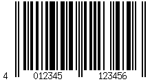
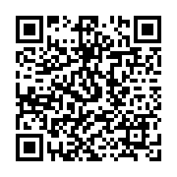

<!-- _class: split -->
# Einführung in die GTIN

<div class="column-left">

**Global Trade Item Number**
Der weltweit eindeutige Identifikationsschlüssel für Handelsartikel

*GS1 Germany – Schulungsmodul 1*

</div>
<div class="column-right">


</div>


---

## Was ist eine GTIN?

- **G**lobal **T**rade **I**tem **N**umber
- Identifiziert jedes Handelsartikel **weltweit eindeutig**
- Vergeben von GS1-Mitgliedsorganisationen
- Anwendung: Handel, Logistik, Gesundheitswesen, E-Commerce

> 💡 Eine GTIN ist **kein Preis**, sondern eine **Identität**.

---

## Aufbau einer GTIN-13

| Bestandteil          | Stellen | Beispiel     |
|----------------------|---------|--------------|
| GS1 Company Prefix   | 6–12    | `4012345`     |
| Artikelreferenz      | 0–6     | `77777`      |
| Prüfziffer           | 1       | `5`          |

**Ergebnis:** `402345777775`

---

## Wo begegnet uns die GTIN?

- 🛒 **Supermarktkasse** – EAN-13-Barcode auf jedem Produkt
- 📦 **Logistik** – GTIN-14 auf Versandkartons
- 🌐 **E-Commerce** – Produktidentifikation bei Amazon, Google Shopping
- 🏥 **Gesundheitswesen** – Eindeutige Identifikation von Medizinprodukten

---

## GTIN vs. Barcode

Die GTIN ist der **Identifikationsschlüssel**, nicht der **Datenträger**.

Hier sehen Sie die GTIN, kodiert in einem EAN-13-Barcode:



---

## GTIN in QR Codes Powered by GS1

Ab 2028 kann die GTIN in eine Webadresse eingebettet werden – so erhalten Ihre Kunden direkten Zugang zu produktbezogenen Informationen.

Am Beispiel derselben GTIN wie zuvor: Diese erscheint nun in einem sogenannten
*GS1 Digital Link URI* und wird in einem QR-Code kodiert:



Kodierter Inhalt:

```
https://id.gs1.de/01/04012345999969

```

---

## Zusammenfassung

✅ GTIN = weltweit eindeutiger Artikelschlüssel
✅ Vergabe über GS1 Company Prefix
✅ Einsatz in **allen** Branchen und Kanälen
✅ Grundlage für Barcode, QR-Code und GS1 Digital Link

---

## Nächstes Modul

**Modul 2:** Der GS1 Digital Link – vom Barcode zur URL

*Fragen? → streaming@example.example*"